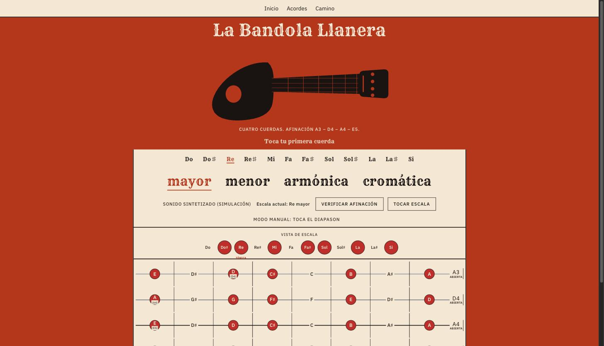

# La Bandola Llanera

Sitio web didáctico para aprender **la bandola llanera**, instrumento ancestral del folclore llanero de Colombia y Venezuela. Muestra el diapasón interactivo del instrumento, permite alternar entre escala mayor, menor, armónica y cromática, y guía al estudiante a través de la afinación, las escalas y los acordes básicos.

Vive en producción en **[bandola.witsaba.com](https://bandola.witsaba.com/)**.



## Por qué existe

Este proyecto nació de mi propio aprendizaje: soy estudiante de bandola llanera y no encontré una referencia web clara, interactiva y en español para practicar afinación, escalas y acordes a mi ritmo. Lo construí para mí y lo comparto para cualquier otro estudiante del instrumento.

## Características

- **Diapasón interactivo** — visualiza las cuatro cuerdas y su afinación (A3–D4–A4–E5).
- **Selector de escalas** — alterna entre mayor, menor, armónica y cromática sobre cualquier tónica.
- **Verificación de afinación y reproducción de escalas** — sonido sintetizado (síntesis Karplus-Strong) para escuchar cada nota o escala.
- **Joropo** (`/joropo`) — círculo armónico del joropo (dominante, tónica y subdominante) con carrusel y diagramas de digitación en el diapasón.
- **Camino del estudiante** (`/camino`) — ruta guiada de aprendizaje: afinación → escalas → acordes.
- Contenido íntegramente en español, sin cuentas ni inicio de sesión, pensado para practicar desde el celular, la tablet o el computador.

## Stack técnico

- [Qwik](https://qwik.dev/) 1.x + Qwik City — resumability y generación de sitio estático (SSG).
- [Vite](https://vitejs.dev/) 7 como build tool.
- TypeScript.
- [Vitest](https://vitest.dev/) + Testing Library para pruebas unitarias.
- ESLint + Prettier para lint y formato.
- Web Audio API para la síntesis de sonido del instrumento.

## Empezando

### Requisitos

- Node.js `^18.17.0`, `^20.3.0` o `>=21.0.0`.
- npm.

### Instalación

```bash
npm install
```

### Desarrollo

```bash
npm run dev
```

Levanta el servidor de desarrollo (modo SSR) en `http://localhost:5173` (o el siguiente puerto libre).

### Pruebas

```bash
npm run test        # corre la suite una vez
npm run test.watch  # modo watch
```

### Lint y formato

```bash
npm run lint
npm run fmt.check
npm run fmt          # aplica el formato
```

### Build de producción

```bash
npm run build          # build completo (tipos + cliente + servidor)
npm run build.static   # build estático para despliegue (ej. GitHub Pages)
```

## Estructura del proyecto

```
src/
├── audio/         # síntesis de sonido (Karplus-Strong) y utilidades de Web Audio
├── components/    # componentes de UI (diapasón, acordes, escalas, footer, menú)
├── hooks/         # hooks reutilizables
├── music/         # datos musicales: afinación, escalas, acordes
└── routes/        # páginas Qwik City (/, /joropo, /camino)
```

## Contribuir

Las contribuciones son bienvenidas — reportes de errores, correcciones de datos musicales (afinaciones, acordes, escalas), mejoras de accesibilidad o de la experiencia de aprendizaje.

1. Haz un fork del repositorio y crea una rama descriptiva.
2. Instala dependencias y corre `npm run test` y `npm run lint` antes de abrir un PR.
3. Describe claramente el cambio y, si corrige un comportamiento del instrumento, indica la fuente o cómo lo verificaste.

## Licencia

Este proyecto está licenciado bajo la [Apache License 2.0](./LICENSE). Puedes usar, copiar, modificar y distribuir este código libremente, incluso con fines comerciales, siempre que conserves el aviso de copyright y de licencia.
